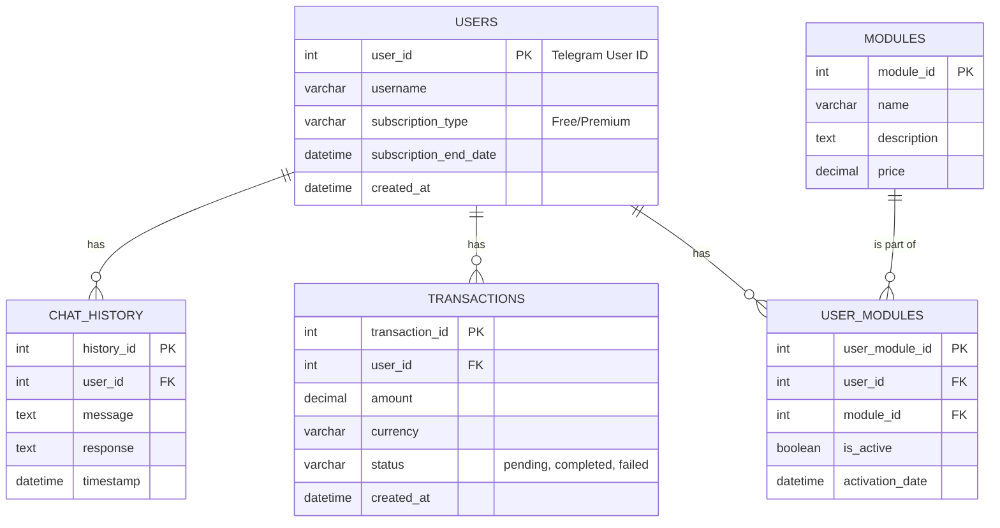

# Архитектура проекта "Guide_AI_Bot"

Этот документ описывает архитектуру телеграм-бота "Guide_AI_Bot", включая структуру каталогов, схему базы данных и взаимодействие компонентов.

## 1. Структура каталогов

Предлагается следующая структура каталогов для обеспечения логического разделения компонентов, масштабируемости и удобства поддержки.

```
guide_ai_bot/
├── alembic/                  # Файлы для миграций базы данных Alembic
│   ├── versions/
│   └── env.py
├── app/                      # Основной исходный код приложения
│   ├── bot/                  # Логика Telegram-бота (Aiogram)
│   │   ├── handlers/         # Обработчики сообщений и колбэков
│   │   │   ├── common.py     # Общие обработчики (start, help)
│   │   │   └── chat.py       # Обработчики, связанные с чатом
│   │   ├── keyboards/        # Клавиатуры для бота
│   │   ├── middlewares/      # Промежуточные слои (например, для аутентификации)
│   │   └── __init__.py
│   ├── core/                 # Ядро приложения
│   │   ├── config.py         # Конфигурация (загрузка из .env, поддержка SQLite/MySQL)
│   │   ├── logging.py        # Настройка логирования
│   │   └── __init__.py
│   ├── db/                   # Работа с базой данных
│   │   ├── models.py         # Модели SQLAlchemy
│   │   ├── repository.py     # Функции для взаимодействия с БД
│   │   └── __init__.py
│   ├── services/             # Бизнес-логика и взаимодействие с внешними API
│   │   ├── ai_service.py     # Взаимодействие с API ИИ
│   │   ├── billing_service.py # Взаимодействие с Robokassa
│   │   └── __init__.py
│   ├── web/                  # Админ-панель на Flask
│   │   ├── templates/        # HTML-шаблоны
│   │   ├── static/           # Статические файлы (CSS, JS)
│   │   └── routes.py         # Маршруты админ-панели
│   └── __init__.py
├── tests/                    # Тесты (pytest)
│   ├── test_handlers.py
│   └── test_db.py
├── .env.dist                 # Пример файла с переменными окружения
├── .gitignore
├── docker-compose.yml        # Для запуска БД и других сервисов
├── Dockerfile                # Для контейнеризации приложения
├── requirements.txt          # Зависимости Python
└── bot.py                    # Точка входа для запуска бота
```

## 2. Схема базы данных (MySQL)

Схема БД спроектирована для хранения информации о пользователях, их взаимодействии с ботом, подписках и транзакциях.



## 3. Диаграмма взаимодействия компонентов

Эта диаграмма показывает, как различные части системы взаимодействуют друг с другом.

```mermaid
graph TD
    subgraph "Пользователь"
        U(Telegram User)
    end

    subgraph "Инфраструктура"
        TG_API(Telegram Bot API)
        DB[(MySQL Database)]
        AI_API(External AI API)
        Robokassa(Robokassa API)
    end

    subgraph "Приложение Guide_AI_Bot"
        Bot(Aiogram Bot)
        AdminPanel(Flask Admin Panel)
        Services(Business Logic Services)
        Repo(Database Repository)
    end

    U -- Сообщения --> TG_API
    TG_API -- Webhook/Polling --> Bot

    Bot -- /start, /chat --> Services
    Bot -- /pay --> Services

    Services -- AI запросы --> AI_API
    Services -- Запросы на оплату --> Robokassa

    Services -- CRUD операции --> Repo
    Repo -- SQL запросы --> DB

    AdminPanel -- Просмотр данных --> Repo
    AdminPanel -- Управление --> Repo

    Robokassa -- Callback об оплате --> Bot